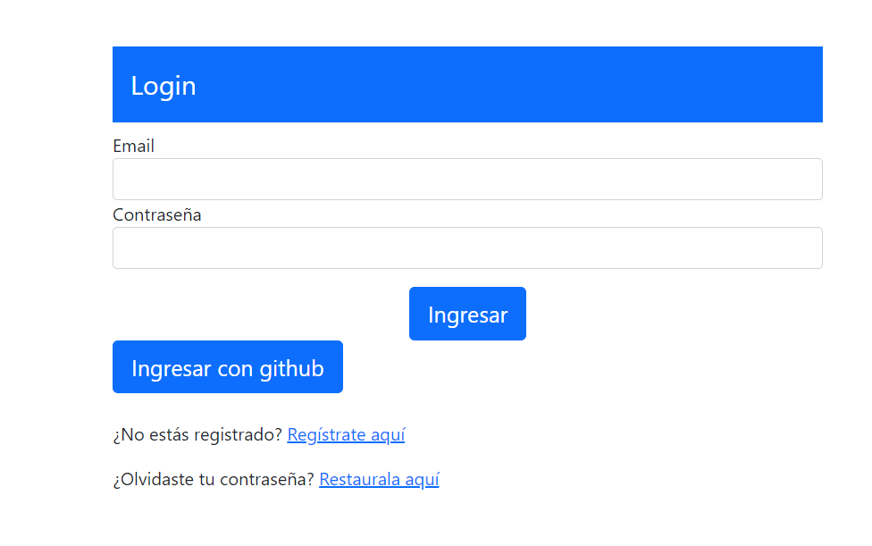
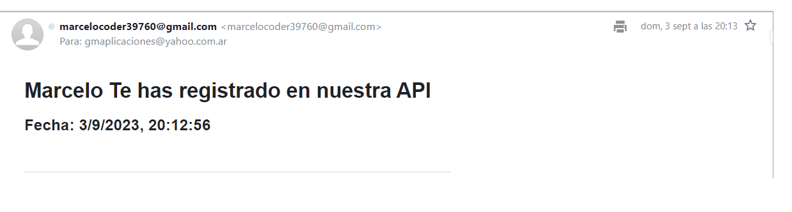
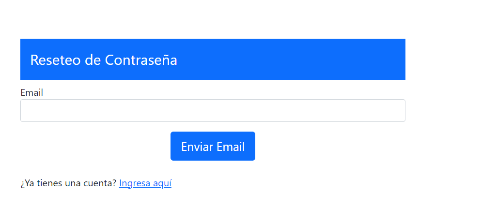
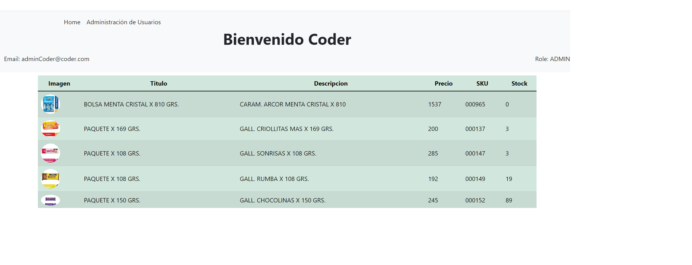
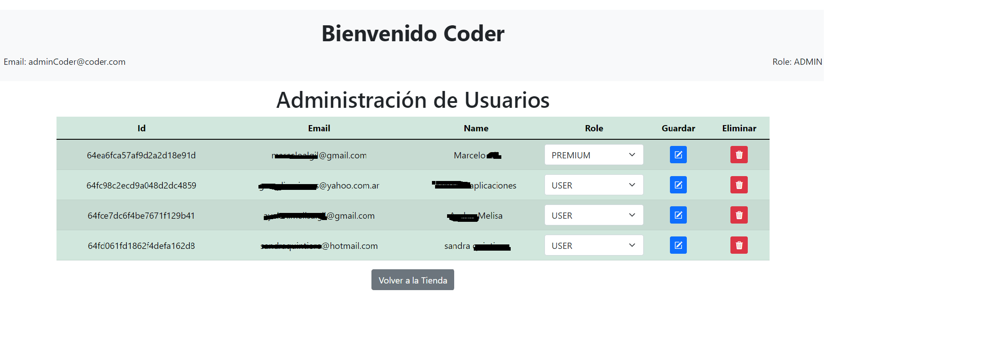
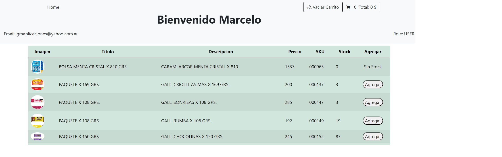
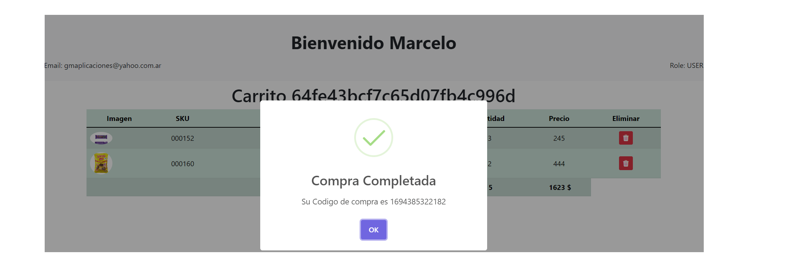
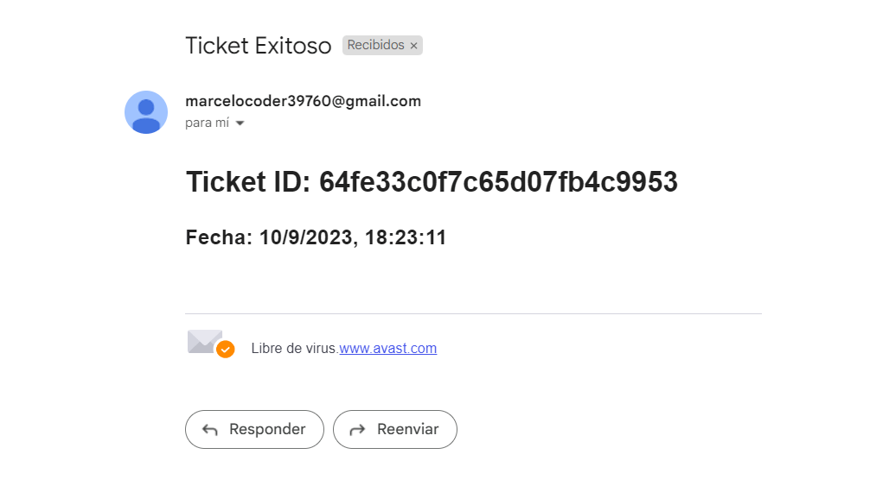

# Proyecto

Proyecto de Backend en cumplimiento al curso de "Programación Backend de CoderHouse".

# Link de navegación:

https://backendcoder-production-cc7a.up.railway.app/

# Ejecucion del proyecto:

`npm run start`

# Ejecucion de test:
`npm run test`

# Documentacion del proyecto:

https://backendcoder-production-cc7a.up.railway.app/api/docs/

# Variables de ambiente:

```
PERSISTENCE=MONGO <persistence>
MONGO_URL=<connection to MongoDB>
ADMIN_PASSWORD=<password admin>
ADMIN_EMAIL=<email admin>
SECRETS=<secret key token>
GMAIL_ACCOUNT=<email account from which to send mail>
GMAIL_PASSWORD=<email password>
FRONTEND_ACCOUNT=""
FRONTEND_EXTERNAL_ACCOUNT=false/true <external frontend>
NODE_ENV=production <enviroment >
PORT_ENV=<connection port>
HTTP_URL=<connection url>
INACTIVITY_TIME=<inactivity time> example d2/h1/m10/s30
```

# Navegación

- Login
    
- Register
    
despues del registro envia un correo de aviso 
    
- Reset Password
    
    Se completa a través del envio de un Email con un link de acceso a ingresar la nueva contraseña

- Si el Usuario es ADMIN accede a la visualización de los productos y a una opcion de navegacion para administrar usuarios
        
      - Administración de usuarios
            Esta opción permite al administrador modificar el rol o la eliminacion del usuario
        

-Si el usuario es USER o PREMIUN accede a la visualización de los productos 
    
    al hacer clik en agregar visualiza el producto y permite agregar al carrito
    
    al hacer clik en carrito se pasa al despliegue de los productos
    
    al Finalizar compra
    
    ademas envia un email con el id del Tiquet
    
-Vaciar el Carrito


